# Model Comparison Table

This comparison was generated using the custom prompt [model-compare.prompt.md](../.github/prompts/model-compare.prompt.md) and data from the GitHub Docs pages cited below.

> [!NOTE]
> Model availability, multipliers, and preview status change frequently. Re-run `/model-compare` to refresh this table with the latest GitHub Copilot documentation.

## 1. Balance Between Performance and Cost

**Pros:** Versatile defaults, low premium usage, reliable structured output.

| Model | Use Case / Differentiator | GA/Preview | Special Abilities | Multiplier |
| --- | --- | --- | --- | --- |
| GPT-4.1 | Balanced default for everyday features, reviews, and docs | ✅ | 🕹 Agent mode, 👓 Vision | 0× (paid) / 1× (free) |
| GPT-5-Codex | Higher-fidelity completions for longer diffs and refactors | 🚧 | 🕹 Agent mode | 1× (paid) |
| Claude Sonnet 4 | Consistent tone & formatting for specs, docs, and summaries | ✅ | 🕹 Agent mode, 👓 Vision | 1× (paid) |

## 2. Fast, Low-Cost Support for Basic Tasks

**Pros:** ⚡ Ultra-low latency, 💸 premium-efficient, great for repetitive edits.

| Model | Use Case / Differentiator | GA/Preview | Special Abilities | Multiplier |
| --- | --- | --- | --- | --- |
| o4-mini | Instant snippets & boilerplate cleanup (sunsetting Oct 23 2025) | ✅ | ⚡ Low latency focus | 0.33× (paid) |
| Grok Code Fast 1 | Quick Q&A across repos with playful outputs | 🚧 | 🕹 Agent mode | 0.25× (paid) |
| Claude Sonnet 3.5 | Fast summaries, docs, and small code fixes | ✅ | 🕹 Agent mode, 👓 Vision | 1× (paid/free) |

## 3. Deep Reasoning & Complex Coding Challenges

**Pros:** 🧠 Multi-step logic, 📚 cross-file awareness, 🔍 precise debugging.

| Model | Use Case / Differentiator | GA/Preview | Special Abilities | Multiplier |
| --- | --- | --- | --- | --- |
| GPT-5 mini | Step-by-step analysis with minimal premium spend | ✅ | 🧠 Reasoning, 👓 Vision | 0× (paid) / 1× (free) |
| GPT-5 | Architecture reviews, design validation, and complex refactors | ✅ | 🧠 Reasoning | 1× (paid) |
| o3 | Root-cause hunts & algorithm design (sunsetting Oct 23 2025) | ✅ | 🧠 Reasoning | 1× (paid) |
| Claude Sonnet 4.5 | Preview hybrid reasoning for multi-stage agent plans | 🚧 | 🕹 Agent mode | 1× (paid) |
| Gemini 2.5 Pro | Research-grade long-context investigations | ✅ | 👓 Vision, 🧪 Analysis | 1× (paid) |

## 4. Multimodal Inputs & Real-Time Performance

**Pros:** 👓 Visual inspection, 🎨 UI triage, 🗣️ conversational prototyping.

| Model | Use Case / Differentiator | GA/Preview | Special Abilities | Multiplier |
| --- | --- | --- | --- | --- |
| GPT-4o | Voice & vision-first prototyping with multilingual support | ✅ | 👓 Vision, 🌐 Multilingual | 0× (paid) / 1× (free) |
| Gemini 2.0 Flash | Real-time screenshot and UI feedback (sunsetting Oct 23 2025) | ✅ | 👓 Vision, ⚡ Low latency | 0.25× (paid) / 1× (free) |
| Claude Opus 4.1 | High-fidelity visual reasoning for complex interfaces | ✅ | 👓 Vision, 🧠 Reasoning | 10× 💰 (paid) |

---

## References

- [Choosing the right AI model for your task](https://docs.github.com/en/copilot/using-github-copilot/ai-models/choosing-the-right-ai-model-for-your-task)
- [Supported AI models in GitHub Copilot](https://docs.github.com/en/copilot/reference/ai-models/supported-models)
- [Requests in GitHub Copilot](https://docs.github.com/en/enterprise-cloud@latest/copilot/managing-copilot/monitoring-usage-and-entitlements/about-premium-requests?versionId=enterprise-cloud@latest)

---

## Model Summary Overview: Performance vs. Quality & Cost

```mermaid
graph LR
    %% Left = faster / lower cost, Right = higher quality & premium usage
    o4m["o4-mini<br/>0.33×<br/>✅"] --> grok["Grok Code Fast 1<br/>0.25×<br/>🚧"]
    grok --> gpt41["GPT-4.1<br/>0× / 1×<br/>✅"]
    gpt41 --> gpt5c["GPT-5-Codex<br/>1×<br/>🚧"]
    gpt5c --> cs4["Claude Sonnet 4<br/>1×<br/>✅"]
    cs4 --> gpt5m["GPT-5 mini<br/>0× / 1×<br/>✅"]
    gpt5m --> gpt5["GPT-5<br/>1×<br/>✅"]
    gpt5 --> cs45["Claude Sonnet 4.5<br/>1×<br/>🚧"]
    cs45 --> g25["Gemini 2.5 Pro<br/>1×<br/>✅"]
    g25 --> co41["Claude Opus 4.1<br/>10×💰<br/>✅"]

    style o4m fill:#ffffff,stroke:#111111,color:#111111
    style grok fill:#ffffff,stroke:#111111,color:#111111
    style gpt41 fill:#cdeafe,stroke:#111111,color:#111111
    style gpt5c fill:#fde2ff,stroke:#111111,color:#111111
    style cs4 fill:#fff4d6,stroke:#111111,color:#111111
    style gpt5m fill:#dbf5ff,stroke:#111111,color:#111111
    style gpt5 fill:#dbf5ff,stroke:#111111,color:#111111
    style cs45 fill:#fde2ff,stroke:#111111,color:#111111
    style g25 fill:#e8fdd8,stroke:#111111,color:#111111
    style co41 fill:#f9d6d6,stroke:#111111,color:#111111
```

